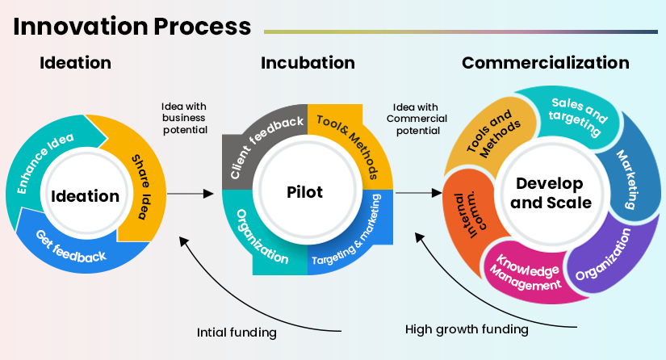

# Fintech-Casestudy - Insurance Tech

##  **Lemonade Inc.**

---

### Lemonade Inc. offers renters' insurance, homeowners' insurance, car insurance, pet insurance and term life insurance in the United States as well as contents and liability policies in Germany, and the Netherlands, and renters insurance in France. The company is based in New York City.

---

###  **Company Background:**
* Stock price: LMND (NYSE) $29.00 -0.46 (-1.56%) Feb 11, 4:00 PM EST 
* Customer service: 1 (844) 733-8666
* CEO: Daniel Schreiber (Jun 2015–)
* Revenue: 94 million USD (2020)
* Founded: April 2015
* Headquarters: New York, NY
* Number of employees: 990 (2021)
* Founders: Daniel Schreiber, Shai Wininger

---

###  *Collaboraters:*
- [X] Amelia Grega
- [X] Patricia Rajamanickam

